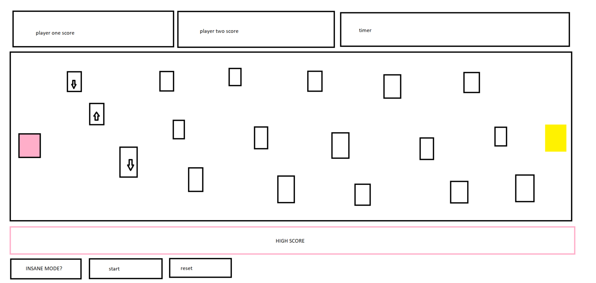

# SNITCHES GET STITCHES

### A game of survival as well as speed. There will be a player controlled unit, who will dodge obstacles, or enemies, to grab the 'snitch'. The player will move from left to right, with the snitch being at the far right. When the snitch is grabbed, the enimies will multiply (probably by a significant number such as 2-5).The 'enemies' will be moving blocks or walls, moving vertically that will kill the players on contact. when the player is killed it will switch to the other players turn. The players are competing against each other to see how fast they can grab the snitches, up to a certain level (lets say 10 or so). Score is equal to time spent + snitches caught. 

 #### created through canvas, html+css+javascript. 

 ### MVP
 *  player one dodges enemies using WASD to reach the snitch at the end. 
 *   every time the snitch is caught, add enemies to the field. 
 *   switch players when player one is eliminated
 *   game is complete after a set (10?) amount of rounds, or when both players are eliminated
 *   score is based on time + snitch's caught (ex. 5.00mins + 10 = 150 pts)

#### potential harships-- 
* getting the score counter right
* producing more enemies each round

#### streeeeeeeeeeeeeeeeeeeeeeeeeeeeeeeeeeeeeetch goals:
* have the enemies start moving randomly, 'insane' mode
* OR have the enemies start moving progressivly faster
* endless mode
